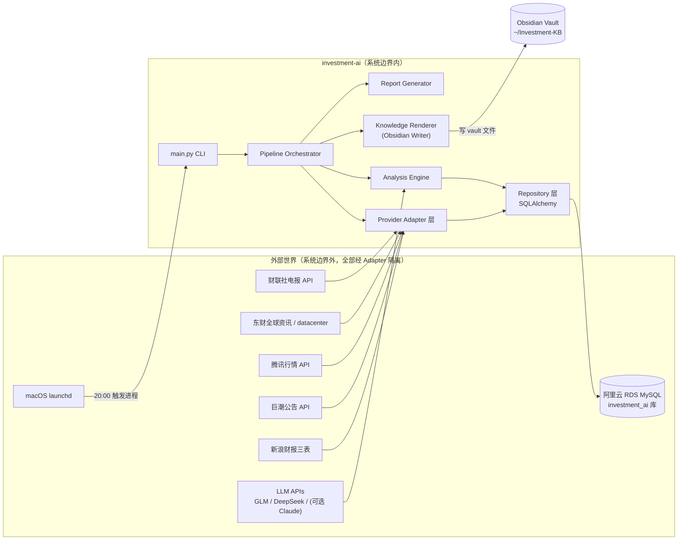
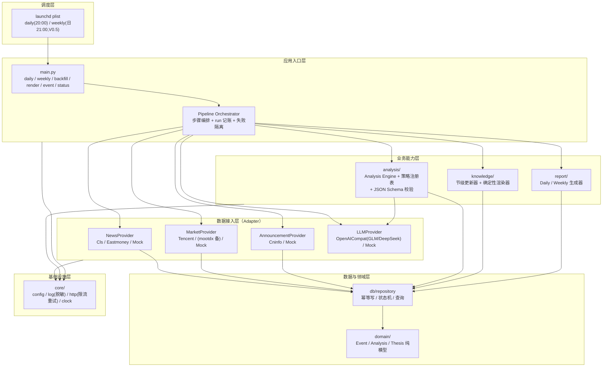
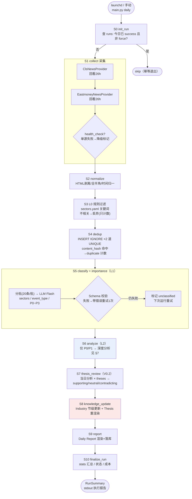
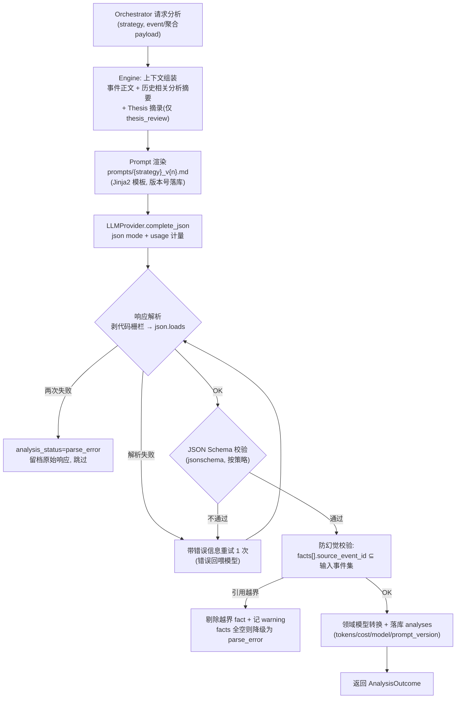
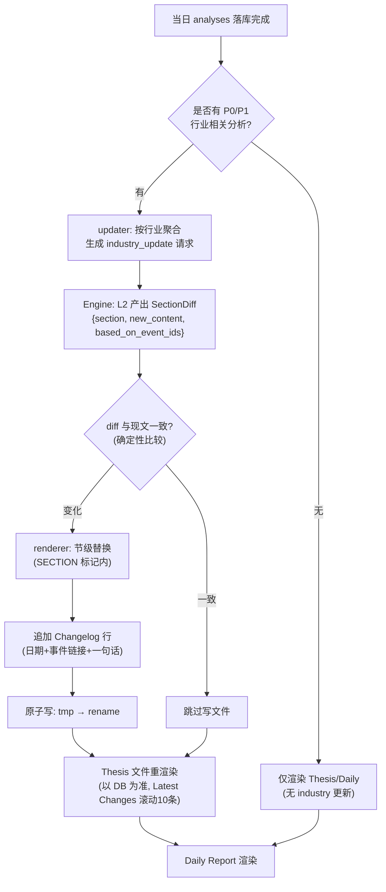
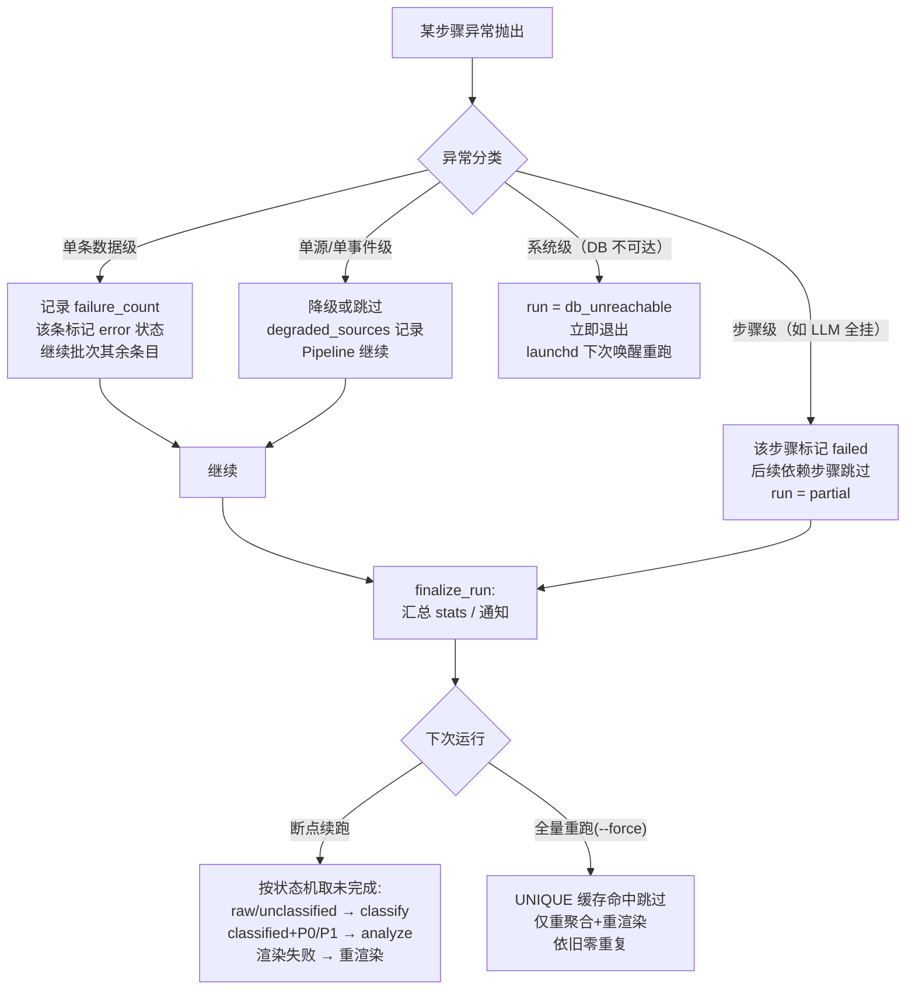

# AI 投资研究系统：架构设计

> Phase 2 产出 | 前置：[feasibility-analysis.md](./feasibility-analysis.md)（Phase 1，已确认）
> 日期：2026-09-17 | 状态：待老板确认后进入 Phase 3（Implementation Plan）

---

## 目录

1. [决策基线（继承自 Phase 1，不再讨论）](#1-决策基线)
2. [系统边界](#2-系统边界)
3. [系统总体架构](#3-系统总体架构)
4. [模块划分与依赖规则](#4-模块划分与依赖规则)
5. [Daily Pipeline 设计](#5-daily-pipeline-设计)
6. [Provider Adapter 层设计](#6-provider-adapter-层设计)
7. [AI Analysis Pipeline 设计](#7-ai-analysis-pipeline-设计)
8. [数据模型（MySQL DDL）](#8-数据模型mysql-ddl)
9. [Knowledge Update Pipeline 与渲染协议](#9-knowledge-update-pipeline-与渲染协议)
10. [调度与 CLI](#10-调度与-cli)
11. [可观测性与成本核算](#11-可观测性与成本核算)
12. [异常流程总设计（Failure / Retry）](#12-异常流程总设计)
13. [配置体系](#13-配置体系)
14. [安全设计](#14-安全设计)
15. [项目目录结构（文件级）](#15-项目目录结构)
16. [对 Phase 3 的输入（任务拆解映射）](#16-对-phase-3-的输入)

---

## 1. 决策基线

以下决策已在 Phase 1 与评审中确定，本文档直接继承，不再重新论证：

| # | 决策 | 出处 |
|---|------|------|
| D1 | 独立项目 investment-ai；与 stock-platform 实例共享、库级隔离 | Feasibility 附录 B |
| D2 | MySQL 独立库 `investment_ai`（阿里云 RDS），连接复用 stock-platform 规范：pymysql + SQLAlchemy 2.0 + Alembic + pool_pre_ping，utf8mb4 | Feasibility §8.0 |
| D3 | 一个 Analysis Engine + 多 Prompt 策略，零自治 Agent | Feasibility §4.1/§7 |
| D4 | Event 只存 MySQL，Obsidian 不放事件文件 | Feasibility §9.1 |
| D5 | Obsidian 长文档节级更新（SECTION 协议），人工编辑共存 | Feasibility §9.2 |
| D6 | LLM 四层：L0 规则 → L1 Flash 分类 → L2 标准深度分析 → L3 可选旗舰；国内 API 优先 | Feasibility §6 |
| D7 | MVP 单入口 `python main.py daily`（20:00），launchd 调度；子命令预留 | Feasibility §4.3 |
| D8 | 数据源：财联社电报 + 东财全球资讯（新闻）、腾讯行情、巨潮公告、新浪三表；东财系限流 ≥1s | Feasibility §5 |
| D9 | 幂等：UNIQUE 约束 + 状态机 + 确定性渲染；重复执行零重复产出 | Feasibility §8.3 |
| D10 | Thesis 只输出 supporting / neutral / contradicting，禁止评分与买卖建议 | 指令十一 |
| D11 | 不引入：Redis / Kafka / Airflow / K8s / 向量库 / Agent Framework / MCP | 指令十三、Feasibility §4.5 |
| D12 | Mock First：每个真实 Provider 配同接口 Mock，先跑通全链路再换真源 | 指令十四 |

---

## 2. 系统边界



**边界规则**：

- 系统内**不直接 import** 任何外部 SDK/URL 常量——所有外部交互收敛在 `providers/`
- Obsidian vault 是**只写不读**的渲染目标（系统不依赖 vault 内容做决策；DB 是唯一事实源，vault 可随时用 `render --all` 全量重建）
- launchd 只是进程触发器，不承载任何业务逻辑（幂等靠 DB，不靠调度器）
- stock-platform 在 MVP 中零依赖；未来跨库只读（Phase 3+）也走 `providers/` 下专用 Provider，不直连

---

## 3. 系统总体架构

分层视图（依赖方向自上而下，同层不互相依赖）：



**架构不变量**（Code Review 时据此判违规）：

1. `domain/` 不 import 任何其他业务模块；`core/` 不 import 业务模块
2. 只有 `providers/` 可以发外部 HTTP/TCP 请求
3. 只有 `db/` 可以执行 SQL；业务模块通过 repository 函数读写
4. 只有 `knowledge/` 与 `report/` 可以写 vault 文件，且必须经确定性渲染器
5. Analysis Engine 是唯一调用 LLMProvider 的入口（成本/Schema/重试统一收口）

---

## 4. 模块划分与依赖规则

| 模块 | 职责 | 关键接口（Python 签名） | 禁止事项 |
|------|------|------------------------|---------|
| `core.config` | 加载 .env + YAML，产出类型化 Settings 单例 | `get_settings() -> Settings` | 不含任何业务默认数据（行业词表在 YAML） |
| `core.log` | 结构化 JSONL 日志，脱敏过滤器（sk-*/Bearer/密码） | `get_logger(run_id)` | 不打印原始 prompt 全文（只打 hash + 长度） |
| `core.http` | 统一 HTTP 客户端：限流（每 host 间隔+抖动）、重试（tenacity 指数退避）、UA、超时 | `get(host_tier) -> HttpClient` | 东财 403 不重试（风控信号） |
| `providers.news` | 快讯采集 → `list[RawEvent]` | `fetch(since: datetime) -> list[RawEvent]`、`health_check() -> bool` | 不做清洗/去重（那是 pipeline 的事） |
| `providers.market` | 指数/板块/涨跌停快照 → `MarketSnapshot` | `fetch_daily(trade_date) -> MarketSnapshot` | — |
| `providers.announcement` | 公告检索 → `list[RawEvent]`（event_type 预置） | `fetch(code_list, since) -> list[RawEvent]` | — |
| `providers.llm` | OpenAI 兼容协议调用，JSON mode + usage 计量 | `complete_json(req) -> LLMResult` | 不做 Schema 校验（Engine 的事） |
| `db.repository` | 8 张表的幂等读写、状态机流转、统计查询 | `upsert_events() / claim_pending() / save_analysis() …` | 不含业务判断（重要性规则不在这） |
| `pipeline.orchestrator` | 步骤编排、run 生命周期、失败隔离与降级 | `run_daily(date, force=False) -> RunSummary` | 不直接调 Provider 细节（经步骤对象） |
| `pipeline.steps.*` | 单一职责步骤：normalize / dedup / classify / analyze / thesis / knowledge / report | `Step.run(ctx) -> StepResult` | 步骤间不互相 import，只通过 ctx 传递 |
| `analysis.engine` | 上下文组装 → Prompt 渲染 → LLM → Schema 校验 → 防幻觉校验 → 落库 | `analyze(strategy, payload) -> AnalysisOutcome` | 不发 HTTP |
| `knowledge.updater` | 节级更新决策（哪些 section 需要重写） | `update_industries(analyses) -> list[SectionDiff]` | 不写文件（交给 renderer） |
| `knowledge.renderer` | 确定性 Markdown 渲染 + 原子写（tmp+rename） | `render_industry(diff) / render_thesis(t) / rebuild_all()` | 渲染函数必须纯（同输入同输出） |
| `report.daily` | Daily Report 数据组装 + 渲染 + 落库 | `generate(date) -> ReportRef` | — |

---

## 5. Daily Pipeline 设计

### 5.1 流程总图



### 5.2 步骤规范（Input / Output / 幂等 / 失败）

落实指令 §30"每一步明确六要素"：

| 步骤 | Input | Output | 调用方 | 失败处理 | 幂等策略 |
|------|-------|--------|--------|---------|---------|
| S0 init_run | date, force | `runs` 行（status=running） | orchestrator | DB 不可达→`db_unreachable` 退出 | 今日已有 success run 且非 force → 直接 skip |
| S1 collect | 回看窗口 26h（可配） | `list[RawEvent]`（内存） | news/announcement providers | 单源失败：记 `degraded_sources`，用备份源；全失败：继续跑（当日无新事件也是一种结果） | 采集本身无状态；窗口重叠靠 S4 去重兜底 |
| S2 normalize | RawEvent | NormalizedEvent（净化标题/正文/ISO 时间） | pipeline | 单条异常→丢弃该条并计数 | 纯函数，天然幂等 |
| S3 L0 filter | NormalizedEvent | 相关事件（落库） / 丢弃计数 | pipeline + sectors.yaml 规则 | 无外部失败模式 | 规则改版后历史不可回溯（取舍：可 backfill 重采，见 §10） |
| S4 dedup | 相关事件 | `events` 新增行（status=raw）；duplicate 计数 | repository | DB 异常→重试 2 次后步骤失败 | `UNIQUE(source,source_id)` + `UNIQUE(content_hash)`，INSERT IGNORE；受影响行=0 → 查冲突键归类 duplicate |
| S5 classify | status=raw 的事件 | importance/sectors/event_type 回填，status=classified | Analysis Engine（strategy=classification，L1） | 单批失败→unclassified 状态，不阻塞他批 | 重跑只取 status∈{raw, unclassified}；结果覆盖写（UPDATE） |
| S6 analyze | status=classified 且 P0/P1 | `analyses` 行，event.status=analyzed | Engine（strategy=event_analysis，L2） | parse_error 留档跳过（§7.6） | `UNIQUE(event_id,strategy,prompt_version)`；已存在→跳过 |
| S7 thesis_review | 当日 analyses + theses 活跃集 | `analyses`(strategy=thesis_review) + `thesis_evidence` + theses.status 变更 | Engine（strategy=thesis_review，L2） | 失败→本日 Thesis 不更新，run=partial | 证据联合主键 INSERT IGNORE；状态变更条件幂等（同证据集→同结论） |
| S8 knowledge_update | 当日 analyses + thesis 变更 | SectionDiff → vault 文件更新 | updater+renderer | 渲染失败→`knowledge_render_failed`，DB 不回滚；下次 `render --all` 或次日自动补 | 节级替换 + 确定性渲染（§9） |
| S9 report | 当日全量数据 | `reports` 行 + `Daily/YYYY-MM-DD.md` | report.daily | 失败→run=partial（报告是最终产物，失败必须可见） | `UNIQUE(type,date)` ON DUPLICATE KEY UPDATE；文件覆盖写 |
| S10 finalize | 各步 StepResult | runs.status/stats_json 更新 | orchestrator | 尽力而为（failure 兜底写 failed 状态） | upsert |

**run 状态机**：`running → success | partial | failed | db_unreachable | skipped`

**event 状态机**：`raw → classified → analyzed`；分支：`unclassified`（可重试）、`parse_error`（终态，留档）、`archived`（P3 归档，可被 thesis_review 之外的流程忽略）

---

## 6. Provider Adapter 层设计

### 6.1 抽象接口（`providers/base.py`）

```python
@dataclass
class RawEvent:
    source: str            # "cls" | "eastmoney" | "cninfo" ...
    source_id: str         # 源内唯一 ID
    title: str
    content: str
    url: str | None
    published_at: datetime
    collected_at: datetime
    raw: dict              # 原始 payload（审计用，JSON 列）

class NewsProvider(Protocol):
    name: str
    def health_check(self) -> bool: ...
    def fetch(self, since: datetime) -> list[RawEvent]: ...

class MarketProvider(Protocol):
    name: str
    def fetch_daily(self, trade_date: date) -> MarketSnapshot: ...

class LLMProvider(Protocol):
    name: str
    def complete_json(self, req: LLMRequest) -> LLMResult: ...

# LLMRequest: system, user, json_schema, model, temperature, max_tokens, timeout
# LLMResult: ok, data(dict)|error, input_tokens, output_tokens, cost_cny, latency_ms
```

### 6.2 实现矩阵

| 抽象 | MVP 实现 | 备份/演进 | 限流策略 |
|------|---------|----------|---------|
| NewsProvider | `ClsNewsProvider`（电报 v1/roll + 本地签名） | `EastmoneyNewsProvider`（np-weblist，与财联社互备，**同时启用**） | 财联社 1s 间隔；东财走 core.http 的 eastmoney 档（≥1s+抖动，403 不重试） |
| MarketProvider | `TencentMarketProvider`（qt.gtimg.cn，V0.3 启用） | `MootdxMarketProvider` | 腾讯批量 60 码/次，不限流 |
| AnnouncementProvider | `CninfoAnnouncementProvider`（V0.4 启用） | 沪深交易所官方页 | 1s 间隔 |
| FinancialDataProvider | `SinaFinancialProvider`（V0.4） | mootdx finance | 低频（财报季日更） |
| LLMProvider | `OpenAICompatProvider`（base_url 可配，覆盖 GLM/DeepSeek/Qwen/Claude 兼容网关） | — | 并发=1，串行调用；全局日预算熔断（§11） |
| 各抽象 | `Mock*Provider`（内置固定样本数据） | — | — |

**实现要点**：

- Mock Provider 读取 `tests/fixtures/*.json`，与真实 Provider 同接口——E2E 测试与本地开发零外部依赖
- Provider 注册表：`providers/__init__.py` 中 `PROVIDERS: dict[str, type]`，settings.yaml 按名字启停（`news_providers: [cls, eastmoney]`）——换数据源 = 改一行配置 + 新增一个类
- 所有东财域名请求必须经 `core.http` 的统一会话（Keep-Alive + UA + 限流），此约束写进 Provider 基类模板

---

## 7. AI Analysis Pipeline 设计

### 7.1 调用流程



### 7.2 策略注册表（`analysis/strategies.py`）

| strategy | 模型档 | 输入 | 输出 Schema | 启用版本 |
|----------|-------|------|------------|---------|
| `classification` | L1（Flash，temp 0.1） | 20 条事件/批（仅标题+首 200 字） | `classification_v1` | V0.1 |
| `event_analysis` | L2（temp 0.3） | 单事件全文 + 相关历史摘要 | `event_analysis_v1` | V0.1 |
| `daily_summary` | L2 | 当日 P0/P1 分析结果集 | `daily_summary_v1` | V0.1 |
| `thesis_review` | L2 | 当日分析 + theses 活跃集（假设/证伪条件/现状） | `thesis_review_v1` | V0.2 |
| `company_impact` | L2 | 命中自选股的事件 + 公司档案 | `event_analysis_v1`（同构） | V0.2 |
| `industry_update` | L2 | 行业当日分析聚合 + 该行业 section 现文 | `industry_update_v1` | V0.3 |
| `market_review` | L2 | MarketSnapshot + 前日快照 | `market_review_v1` | V0.3 |
| `devil_advocate` | L2/L3 | 当日 supporting 分析 + Thesis 全文 | `devil_advocate_v1` | V0.5 |
| `weekly_review` | L3（可选旗舰） | 7 天 Daily + Thesis 变更史 | `weekly_review_v1` | V0.5 |

注册表示例：

```python
STRATEGIES = {
    "event_analysis": Strategy(
        tier="L2",
        schema=event_analysis_v1,
        prompt="event_analysis_v1.md",
        max_input_events=1,
    ),
    ...
}
```

### 7.3 核心输出 Schema：`event_analysis_v1`

```json
{
  "summary": "string, <=120字",
  "facts": [
    {"text": "string", "source_event_id": "必须引用输入事件ID"}
  ],
  "interpretations": ["string"],
  "hypotheses": ["string"],
  "affected_industries": ["sector_key, 枚举值必须来自 sectors.yaml"],
  "affected_companies": [{"name": "string", "code": "string|null", "channel": "传导路径一句话"}],
  "causal_chain": ["产业环节1", "环节2", "..."],
  "supporting_evidence": [{"text": "string", "source_event_id": "string"}],
  "counter_evidence": [{"text": "string", "source_event_id": "string"}],
  "uncertainty": ["string, 必填至少1条，可为'暂无重大不确定性但需观察X'"],
  "follow_up_questions": ["string, 1~3条"]
}
```

Schema 校验规则（jsonschema draft-07，`additionalProperties: false` 收紧）：

- 枚举字段（affected_industries）校验合法值——**幻觉行业名直接打回重试**
- facts/supporting_evidence/counter_evidence 的 `source_event_id` 必须在输入集合内（防编造引用）
- `uncertainty` 最少 1 条（强制声明认知边界，落实"AI 推测不得包装成事实"）
- 所有事件引用在渲染为 Markdown 时自动生成回链（§9.4）

### 7.4 `thesis_review_v1`（落实指令十一：无评分）

```json
{
  "thesis_id": "枚举自活跃 theses",
  "direction": "supporting | neutral | contradicting",
  "evidence": [{"text": "string", "source_event_id": "string", "weight": "strong|weak"}],
  "falsification_triggered": {"triggered": false, "condition_id": "string|null", "reason": "string"},
  "note": "<=200字，为什么",
  "next_questions": ["string"]
}
```

**Thesis 状态变更规则（代码强制，不信任 LLM 自由发挥）**：

- `theses.status` 只能由 repository 按规则流转：`active → weakened`（连续 N=3 日 contradicting 强证据）`→ falsified`（触发证伪条件）；恢复需人工 `python main.py thesis restore <id>`
- 单日方向标注不改变 status，只进 `thesis_evidence` 与 Thesis 文件的 Latest Changes
- Devil Advocate 的产出只能作为 contradicting 证据候选，**权重上限 weak**（区分"理论风险"与"实际反证"，落实原始需求 §12）

### 7.5 模型档位与配置（settings.yaml）

```yaml
llm:
  tiers:
    L1: {provider: openai_compat, model: glm-4.7-flash, temperature: 0.1, max_tokens: 800}
    L2: {provider: openai_compat, model: deepseek-chat, temperature: 0.3, max_tokens: 2000}
    L3: {provider: openai_compat, model: glm-5, temperature: 0.3, max_tokens: 4000}
  providers:
    openai_compat:
      base_url: ${LLM_BASE_URL}     # .env 注入
      api_key: ${LLM_API_KEY}
  daily_budget_cny: 10              # 熔断线：超预算停止 L2，仅保留 L1 分类
```

### 7.6 异常输出分类与处置

| 异常 | 检测点 | 处置 |
|------|--------|------|
| JSON 语法错误 | json.loads | 带错误重试 1 次 → parse_error |
| 代码栅栏污染（```json ... ```） | 剥壳正则预处理 | 剥壳后通常可恢复，不计失败 |
| 字段缺失/类型错 | jsonschema | 同上重试 → parse_error |
| 枚举幻觉（编造行业） | jsonschema enum | 同上重试 → parse_error |
| 引用幻觉（编造 event_id） | Engine 防幻觉校验 | 剔除该条 + warning；全空 → parse_error |
| 空洞输出（summary 过短/模板化） | 长度下限校验 | 记 quality_flag，不重试（留给 prompt 迭代） |
| 超时（60s）/限流 | provider | 指数退避重试 2 次 → 该事件 unanalyzed，下次运行续跑 |

---

## 8. 数据模型（MySQL DDL）

库：`investment_ai`（utf8mb4 / utf8mb4_0900_ai_ci，MySQL 8.0）。Alembic 管理，以下为目标 DDL 摘要。

```sql
-- 事件表（唯一事实来源；Event 不渲染进 Obsidian）
CREATE TABLE events (
  id            VARCHAR(16)  PRIMARY KEY,          -- sha1(source:source_id)[:16]
  source        VARCHAR(32)  NOT NULL,
  source_id     VARCHAR(64)  NOT NULL,
  source_url    VARCHAR(512) NULL,
  content_hash  CHAR(40)     NOT NULL,              -- sha1(norm_title + norm_body)
  title         VARCHAR(512) NOT NULL,
  content       MEDIUMTEXT   NOT NULL,
  published_at  DATETIME     NOT NULL,
  collected_at  DATETIME     NOT NULL,
  sectors       VARCHAR(256) NULL,                 -- JSON array
  event_type    VARCHAR(32)  NULL,                 -- capacity/policy/earnings/catalyst/...
  importance    VARCHAR(4)   NULL,                 -- P0/P1/P2/P3
  status        VARCHAR(16)  NOT NULL DEFAULT 'raw',
  raw_payload   JSON         NULL,                 -- 源原始报文（审计）
  UNIQUE KEY uk_source (source, source_id),
  UNIQUE KEY uk_hash  (content_hash),
  KEY idx_pub  (published_at),
  KEY idx_work (status, importance)
);

-- LLM 分析结果（版本化，天然结果缓存）
CREATE TABLE analyses (
  id             BIGINT PRIMARY KEY AUTO_INCREMENT,
  event_id       VARCHAR(16) NULL,                 -- 事件级分析必填；聚合类(thesis/daily)为 NULL
  report_date    DATE         NULL,                -- 聚合类分析归属日期
  strategy       VARCHAR(32)  NOT NULL,
  model          VARCHAR(64)  NOT NULL,
  prompt_version VARCHAR(16)  NOT NULL,
  result_json    JSON         NOT NULL,
  input_tokens   INT NOT NULL DEFAULT 0,
  output_tokens  INT NOT NULL DEFAULT 0,
  cost_cny       DECIMAL(10,4) NOT NULL DEFAULT 0,
  quality_flag   VARCHAR(16)  NULL,                -- ok / shallow / degenerated
  created_at     DATETIME NOT NULL DEFAULT CURRENT_TIMESTAMP,
  UNIQUE KEY uk_anal (event_id, strategy, prompt_version),
  UNIQUE KEY uk_agg (report_date, strategy, prompt_version),
  KEY idx_strategy (strategy, created_at)
);

-- 投资假设（无评分字段；状态由规则流转，见 §7.4）
CREATE TABLE theses (
  id            VARCHAR(64) PRIMARY KEY,           -- slug: ai-demand-growth
  title         VARCHAR(256) NOT NULL,
  core_hypothesis TEXT NOT NULL,
  falsification_conditions JSON NOT NULL,          -- [{id, condition, metric}]
  key_metrics   JSON NULL,
  related_companies JSON NULL,                     -- [code]
  related_sectors   JSON NULL,
  status        VARCHAR(16) NOT NULL DEFAULT 'active',  -- active/weakened/falsified/archived
  version       INT NOT NULL DEFAULT 1,
  created_at    DATETIME NOT NULL,
  updated_at    DATETIME NOT NULL
);

CREATE TABLE thesis_versions (        -- 修订历史（version 全量快照）
  thesis_id VARCHAR(64) NOT NULL,
  version   INT NOT NULL,
  snapshot  JSON NOT NULL,
  changed_by VARCHAR(16) NOT NULL,    -- system / human
  created_at DATETIME NOT NULL,
  PRIMARY KEY (thesis_id, version)
);

CREATE TABLE thesis_evidence (        -- 证据关联（幂等核心表）
  thesis_id  VARCHAR(64) NOT NULL,
  event_id   VARCHAR(16) NOT NULL,
  analysis_id BIGINT NULL,
  direction  VARCHAR(16) NOT NULL,   -- supporting/neutral/contradicting
  weight     VARCHAR(8)  NOT NULL DEFAULT 'weak',
  note       VARCHAR(1024) NULL,
  review_date DATE NOT NULL,
  created_at DATETIME NOT NULL DEFAULT CURRENT_TIMESTAMP,
  PRIMARY KEY (thesis_id, event_id, review_date)
);

CREATE TABLE reports (
  id            BIGINT PRIMARY KEY AUTO_INCREMENT,
  type          VARCHAR(16) NOT NULL,             -- daily/weekly
  report_date   DATE NOT NULL,
  obsidian_path VARCHAR(512) NULL,
  metrics_json  JSON NULL,                        -- 当日指标快照
  created_at    DATETIME NOT NULL,
  UNIQUE KEY uk_report (type, report_date)
);

CREATE TABLE runs (                   -- 每次执行一条（可观测性核心）
  run_id     CHAR(36) PRIMARY KEY,
  command    VARCHAR(32) NOT NULL,
  report_date DATE NOT NULL,
  started_at DATETIME NOT NULL,
  finished_at DATETIME NULL,
  status     VARCHAR(16) NOT NULL DEFAULT 'running',
  stats_json JSON NULL,               -- §11 字段清单
  KEY idx_date (report_date, status)
);

CREATE TABLE daily_snapshots (        -- V0.3 行情层
  trade_date  DATE PRIMARY KEY,
  snapshot    JSON NOT NULL           -- 指数/板块/涨停池/成交额
);

CREATE TABLE companies (              -- V0.2（companies.yaml 为种子源）
  code     VARCHAR(12) PRIMARY KEY,
  name     VARCHAR(64) NOT NULL,
  sector   VARCHAR(64) NULL,
  watched  TINYINT(1) NOT NULL DEFAULT 1,
  profile  JSON NULL                  -- 公司档案（供 company_impact 上下文）
);
```

去重设计说明：`uk_source` 拦同源重复；`uk_hash` 拦全文转载/接口重推。**跨媒体改写式转载（正文不同）MVP 不做语义去重**——接受少量重复分析（成本可控），V0.6+ 若确有需要再加 SimHash 近似层（决策记录，避免过度设计）。

---

## 9. Knowledge Update Pipeline 与渲染协议

### 9.1 流程



### 9.2 SECTION 协议（长文件与人工编辑共存）

```markdown
# AI / 半导体

<!-- IAI:SECTION:overview START (v3, 2026-09-17) -->
（系统管理区：AI 生成/更新的内容）
<!-- IAI:SECTION:overview END -->

## 我的私人笔记（无标记 → 系统永不触碰）

<!-- IAI:SECTION:changelog START -->
| 日期 | 变化 | 证据 |
|---|---|---|---
| 2026-09-17 | 先进封装供需趋紧 | [[2026-09-17#e4f1]] |
<!-- IAI:SECTION:changelog END -->
```

规则：

- 渲染器只重写 `IAI:SECTION:*` 区间；区间外字节不动（人工内容受保护）
- 每个行业文件由系统**首创建**时即带全部分节骨架；删节/加节需 bump 骨架版本（配置驱动）
- Thesis 文件同理：`hypothesis / evidence_for / evidence_against / falsification / metrics / latest_changes` 分节
- **先写 DB 后写文件**：文件渲染失败不回滚 DB（DB 是唯一事实源；`render --all` 可重建全部 vault 文件）

### 9.3 Vault 布局

```
~/Investment-KB/
├── Industries/{AI-Semiconductor,Power-Energy,Robotics}.md      # 长文件，节级演进
├── Companies/{code}-{name}.md                                  # V0.2
├── Theses/{slug}.md                                            # DB 双源，DB 为准
├── Daily/2026-09-17.md                                         # 1 文件/天
├── Weekly/2026-W38.md                                          # V0.5
└── Home.md                                                     # 入口：状态板（活跃 Thesis 徽章 + 最近 N 天链接）
```

### 9.4 溯源链（落实指令十）

Daily Report 中每个 P0 事件块尾部自动渲染来源脚注：

```
> 来源: 财联社电报 · 2026-09-17 14:32 · [原文链接](https://...) · event:e4f1a2b3
> 分析: deepseek-chat · event_analysis_v1 · 2026-09-17 20:05
```

Thesis 的每条 evidence 链接 `[[Daily/YYYY-MM-DD#event锚点]]`。**链路：Thesis 结论 → 证据 → 当日分析 → 事件 → 源 URL**，Obsidian 内两跳可达原文。

---

## 10. 调度与 CLI

### 10.1 CLI（`main.py`）

| 命令 | 作用 | 幂等语义 |
|------|------|---------|
| `daily [--date D] [--force] [--providers mock\|real]` | 完整 Pipeline | 当日已 success 且非 force → skip；--force 重分析也复用 `UNIQUE` 缓存（仅重渲染+重聚合） |
| `weekly [--date D]` | 周报（V0.5） | `uk_report` upsert |
| `thesis {list / show / restore / seed}` | Thesis 管理 | restore 记 version+changed_by=human |
| `render {--all / --thesis id / --industries}` | 从 DB 重建 vault | 确定性渲染，重复执行无害 |
| `event <id>` | 终端查看事件全文+分析 | 只读 |
| `status [--days 7]` | 最近 runs/成本概览 | 只读 |
| `backfill --since --until` | 历史重采（配合财联社翻页） | 全链路幂等 |

### 10.2 launchd

- `launchd/com.investment-ai.daily.plist`：`StartCalendarInterval` 20:00；`RunAtLoad=false`；日志重定向 `logs/daily-launchd.log`；进程级超时由 Python 侧 watchdog（总时长 > 30min 自杀退出，防 hang 占用）
- Mac 睡眠错过触发 → 唤醒后 launchd 补跑一次 → `daily` 入口的 skip 检查防重复
- 手动执行与 launchd 执行走同一入口（`python main.py daily`），保证行为一致

---

## 11. 可观测性与成本核算

**runs.stats_json 字段**（每次执行结束写入 + stdout 打印执行报告）：

```json
{
  "events_fetched": 412, "events_l0_filtered": 296, "events_deduplicated": 18,
  "events_new": 98, "events_classified": 98,
  "by_importance": {"P0": 3, "P1": 14, "P2": 61, "P3": 20},
  "events_analyzed": 17, "parse_errors": 1,
  "thesis_updates": {"ai-demand-growth": "neutral", "power-infrastructure": "supporting"},
  "llm_calls": 27, "input_tokens": 184000, "output_tokens": 31000,
  "estimated_cost_cny": 0.62,
  "success_count": 98, "failure_count": 2,
  "degraded_sources": ["eastmoney_global_news"],
  "duration_sec": 312
}
```

- 日志：`logs/YYYY-MM-DD.jsonl`，`run_id` 贯穿所有记录；LLM 请求只记 hash/长度/token，不记全文
- 成本：`analyses` 行级 → run 聚合 → `status --days` 月度汇总；**日预算熔断**：estimated_cost 超预算 → 停 L2 深度分析（保留 L1 分类与报告生成），run 状态 partial + 醒目告警行
- 失败通知：run 终态非 success 时 `osascript display notification`（macOS 通知中心）

---

## 12. 异常流程总设计

### 12.1 重试矩阵（分层收口）

| 层 | 机制 | 参数 | 不重试的情况 |
|----|------|------|-------------|
| HTTP（数据源） | tenacity 指数退避 | 3 次，2s/4s/8s，超时 15s | 东财 403（风控信号→降速+换源） |
| LLM | 超时+5xx 重试；Schema 失败带错误重试 | 各 1~2 次 | 4xx（密钥/配额）→ 立即失败并告警 |
| MySQL | pool_pre_ping + 调用重试 | 2 次 | 连续失败 → `db_unreachable` 快速退出 |
| 文件写 | 原子写 tmp+rename；目录校验 | — | vault 路径无效 → `knowledge_render_failed` |

### 12.2 Failure / Retry Flow



### 12.3 关键失败场景演练（设计验收用）

| 场景 | 系统行为 | 验证点 |
|------|---------|--------|
| 财联社接口 404 | 降级东财，degraded_sources 记录，当日事件可能偏少但 Pipeline success | 单源不阻塞 |
| LLM 密钥失效 | L1/L2 全部 4xx → 步骤 failed → run partial + 通知 | 不静默失败 |
| LLM 返回 markdown 包裹 JSON | 剥栅栏恢复，不计失败 | 容错解析 |
| RDS 维护窗口 | db_unreachable 快速退出，launchd 补跑 | 幂等零重复 |
| Obsidian vault 被 iCloud 锁文件 | 渲染失败不回滚 DB；次日自动重渲染 | DB 是事实源 |
| 当日无任何相关事件 | 产出"平静日" Daily（只含市场概览与 Thesis 无变化声明） | 平静也是有效产出 |
| 20:00 Mac 睡眠 | 唤醒补跑 + skip 检查 | 调度可靠 |

---

## 13. 配置体系

```
config/
├── settings.yaml      # 运行参数：回看窗口/批大小/预算熔断/模型档位/vault路径/启停 provider
├── sectors.yaml       # 3 行业：name/keywords(L0)/render_name(Obsidian 文件名)/sections(骨架)
├── companies.yaml     # V0.2 自选股种子
└── theses.yaml        # Thesis 种子（首次 seed 入库；此后 DB 为准）
```

- **代码与配置完全分离**：换行业=改 sectors.yaml；换模型=改 settings.yaml；换数据源=改 provider 启停
- `.env`（不入 git）：`DB_HOST/DB_PORT/DB_USER/DB_PASSWORD/DB_NAME=investment_ai` + `LLM_API_KEY/LLM_BASE_URL`——与 stock-platform 键名规范一致
- 所有配置经 `core.config.Settings` 类型化（pydantic），启动时校验失败即快速退出

---

## 14. 安全设计

继承 Feasibility §12，工程落点：

- 密钥只存在于 `.env`（gitignore 兜底 `*.env`）；`core.log` 注入脱敏 filter（正则拦 `sk-`、`Bearer`、`password=`）
- HTTP 出站仅允许 provider 白名单域名（core.http 按 host 配置）
- 原始报文 `raw_payload` 只存元数据与正文，不存 cookie/鉴权头
- DB 账号仅授权 `investment_ai` 库（DML），无跨库权限——隔离的最后防线在 DB 层而非应用层
- 日志与 Obsidian 渲染不输出 API Key 与完整 prompt

---

## 15. 项目目录结构

```
investment-ai/
├── main.py
├── pyproject.toml                # 依赖：sqlalchemy/alembic/pymysql/pydantic-settings/
│                                 #        jinja2/jsonschema/httpx/tenacity/python-dotenv/pyyaml/pytest
├── .env.example
├── alembic.ini
├── alembic/versions/
├── config/
│   ├── settings.yaml
│   ├── sectors.yaml
│   ├── companies.yaml            # V0.2
│   └── theses.yaml
├── app/
│   ├── core/                     # config.py / log.py / http.py / clock.py
│   ├── domain/                   # event.py / analysis.py / thesis.py / report.py（纯 dataclass）
│   ├── db/                       # engine.py（§ Feasibility 8.0 连接规范）/ models.py / repository.py / migrations_helper.py
│   ├── providers/
│   │   ├── base.py               # Protocol + RawEvent + 注册表
│   │   ├── news/{cls,eastmoney,mock}.py
│   │   ├── market/{tencent,mock}.py
│   │   ├── announcement/{cninfo,mock}.py        # V0.4
│   │   ├── finance/{sina,mock}.py               # V0.4
│   │   └── llm/{openai_compat,mock}.py
│   ├── pipeline/
│   │   ├── orchestrator.py       # run 生命周期 + 步骤编排 + 失败隔离
│   │   ├── context.py            # StepContext（run_id/settings/repo 引用）
│   │   └── steps/                # collect/normalize_filter_dedup/classify/analyze/thesis/knowledge/report
│   ├── analysis/
│   │   ├── engine.py
│   │   ├── strategies.py
│   │   └── schemas/              # *.schema.json（jsonschema draft-07）
│   ├── knowledge/
│   │   ├── updater.py            # 节级更新决策
│   │   └── renderer.py           # 确定性渲染 + 原子写 + SECTION 协议
│   └── report/
│       ├── daily.py
│       └── weekly.py             # V0.5
├── prompts/                      # {strategy}_v{n}.md（Jinja2）
├── launchd/
│   └── com.investment-ai.daily.plist
├── tests/
│   ├── unit/                     # dedup/classify 规则/schemas/renderer（快照测试）
│   ├── integration/              # provider(mock)→pipeline→db(sqlite 内存或本地 mysql)→vault(tmp 目录)
│   ├── schema/                   # LLM 输出校验：合法/缺字段/坏 JSON/污染/幻觉引用
│   ├── idempotency/              # daily 连跑两次全量断言
│   ├── recovery/                 # 超时/坏 JSON/DB 断连/渲染失败注入
│   └── e2e/test_daily_mock.py    # mock 全链路 → vault 产物断言
├── tests/fixtures/               # 各 Provider 样本 JSON / LLM 响应样本（含畸形样本）
├── data/raw_cache/               # 采集原始响应缓存（先落盘再入库）
├── logs/
└── docs/                         # feasibility-analysis.md / architecture.md / implementation-plan.md
```

**测试环境 DB 策略**：单测不碰 MySQL（纯函数 + 内存 repo fake）；集成/E2E 用 `TEST_DB_NAME=investment_ai_test`（同实例测试库，事务回滚或 DROP 重建），CI/本地均可跑。

---

## 16. 对 Phase 3 的输入

本架构直接映射为 Implementation Plan 的任务组（细节在 Phase 3 文档展开）：

| 任务组 | 覆盖模块 | 对应章节 |
|--------|---------|---------|
| TG1 项目骨架 | pyproject/alembic/core/config/log | §13/§14/§15 |
| TG2 数据层 | db/（engine/models/repository）+ DDL 迁移 + 幂等测试 | §8 |
| TG3 Provider 层 | base + 全部 Mock + cls/eastmoney 真实源 + 限流 | §6 |
| TG4 Analysis Engine | engine/strategies/schemas + prompts v1 + 校验测试 | §7 |
| TG5 Pipeline | orchestrator/steps（S0~S10）+ 状态机 | §5 |
| TG6 Knowledge | SECTION 协议/updater/renderer + 快照测试 | §9 |
| TG7 Report | daily 生成 + metrics | §5/§11 |
| TG8 调度与运维 | CLI 全命令/launchd/watchdog/通知 | §10 |
| TG9 测试收口 | idempotency/recovery/e2e 全套 | §12.3 |

---

**本文档结束。确认后进入 Phase 3：`docs/implementation-plan.md`（TASK 级拆解）。**
