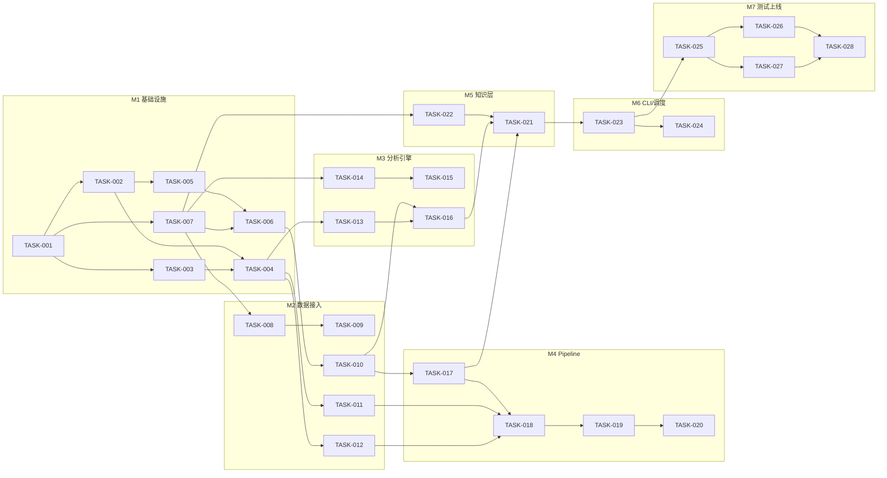

# AI 投资研究系统：Implementation Plan（V0.1 MVP）

> Phase 3 产出 | 前置：[architecture.md](./architecture.md)（Phase 2，已确认）
> 日期：2026-09-17 | 状态：待老板确认后进入 Phase 4（编码）
>
> **范围**：本文档拆解 **V0.1 MVP**（Feasibility §14.1 边界：新闻采集→去重→分类→重要性→深度分析→Obsidian Daily→launchd）。V0.2+ 只列路线概览（§5），到版本前再细化，避免提前设计。

---

## 目录

1. [通用约定](#1-通用约定)
2. [任务总览与依赖图](#2-任务总览与依赖图)
3. [M1 基础设施（TASK-001 ~ 007）](#3-m1-基础设施)
4. [M2 数据接入（TASK-008 ~ 012）](#4-m2-数据接入)
5. [M3 分析引擎（TASK-013 ~ 016）](#5-m3-分析引擎)
6. [M4 Pipeline（TASK-017 ~ 021）](#6-m4-pipeline)
7. [M5 知识层（TASK-022）](#7-m5-知识层)
8. [M6 CLI 与调度（TASK-023 ~ 024）](#8-m6-cli-与调度)
9. [M7 测试与上线（TASK-025 ~ 028）](#9-m7-测试与上线)
10. [验收清单（V0.1 Definition of Done）](#10-验收清单)
11. [V0.2+ 路线概览](#11-v02-路线概览)

---

## 1. 通用约定

**适用所有 TASK，不逐条重复。**

### 1.1 编码与环境

- Python 3.11+；类型注解使用 `typing.Optional[X]` / `Union[X, Y]`（遵守用户全局编码偏好，`from __future__ import annotations` 可选）
- 依赖（pyproject）：`sqlalchemy>=2.0`、`alembic`、`pymysql`、`pydantic>=2`、`pydantic-settings`、`python-dotenv`、`pyyaml`、`jinja2`、`jsonschema`、`httpx`、`tenacity`、`pytest`（dev）
- 测试命令统一：`pytest tests/ -x -q`；单模块：`pytest tests/unit/test_xxx.py -q`
- 代码中**禁止**出现：硬编码密钥、硬编码行业关键词（一律 sectors.yaml）、LLM 直出 Markdown 进 vault

### 1.2 执行纪律

- **一个 TASK 一次提交**（commit message：`TASK-0XX: 摘要`）；TASK 内测试不过不提交
- 每个 TASK 完成即跑该 TASK 的"测试方式"小节命令；里程碑（M1~M7）末跑全量回归
- 遇到与架构文档冲突的实现细节：以架构不变量（architecture §3）为准，小偏差记录进本文件"实施备注"节，大偏差停下问老板

### 1.3 数据库环境

- 开发/测试：同 RDS 实例库 `investment_ai_test`（`TEST_DB_NAME` 覆盖），每个测试用例事务回滚或 `DROP/CREATE`
- 生产：库 `investment_ai`，独立 DB 账号仅授权本库（上线前老板在 RDS 控制台建账号，TASK-028 依赖）
- 迁移纪律：只新增 alembic revision，禁止手改线上表

---

## 2. 任务总览与依赖图

| TASK | 名称 | 依赖 | 里程碑 | 预估 |
|------|------|------|--------|------|
| 001 | 项目初始化与依赖 | — | M1 | 0.5h |
| 002 | 配置系统 | 001 | M1 | 1h |
| 003 | 日志与时钟 | 001 | M1 | 0.5h |
| 004 | HTTP 客户端（限流/重试） | 002,003 | M1 | 1.5h |
| 005 | MySQL 连接与 Alembic 脚手架 | 002 | M1 | 1h |
| 006 | 数据库迁移与 ORM 模型 | 005,007 | M1 | 2h |
| 007 | 领域模型 | 001 | M1 | 1h |
| 008 | Provider 抽象与注册表 | 007 | M2 | 1h |
| 009 | Mock Providers | 008 | M2 | 1.5h |
| 010 | Repository 层（幂等/状态机） | 006 | M2 | 2.5h |
| 011 | 财联社 NewsProvider | 004,008 | M2 | 2h |
| 012 | 东财 NewsProvider | 004,008 | M2 | 1.5h |
| 013 | LLM OpenAICompat Provider | 004,008 | M3 | 1.5h |
| 014 | JSON Schema 与校验器 | 007 | M3 | 1.5h |
| 015 | Prompt 模板 v1 | 014 | M3 | 2h |
| 016 | Analysis Engine 与策略注册表 | 010,013,014,015 | M3 | 3h |
| 017 | Orchestrator 骨架 | 010 | M4 | 2h |
| 018 | 步骤 S1~S4（采集/清洗/过滤/去重） | 011,012,017 | M4 | 2.5h |
| 019 | 步骤 S5（L1 分类） | 016,018 | M4 | 1.5h |
| 020 | 步骤 S6（L2 深度分析） | 019 | M4 | 1.5h |
| 021 | 步骤 S9+S10（Daily Report + finalize） | 016,017,022 | M4 | 2h |
| 022 | 渲染器与 SECTION 协议 | 007 | M5 | 3h |
| 023 | CLI main.py | 017,021,022 | M6 | 1.5h |
| 024 | launchd + watchdog + 通知 | 023 | M6 | 1.5h |
| 025 | 集成测试（幂等 daily×2） | 021,023 | M7 | 2h |
| 026 | 失败恢复测试（注入矩阵） | 025 | M7 | 2.5h |
| 027 | E2E（mock 全链路） | 025 | M7 | 1.5h |
| 028 | 真实源联调与上线验收 | 025~027 | M7 | 3h |

**预估合计 ≈ 3.5~4.5 个工作日**（与 Feasibility §14.1 的 3~5 天一致）。



---

## 3. M1 基础设施

### TASK-001 项目初始化与依赖

- **目标**：可安装、可导入、git 就绪的空项目骨架
- **前置依赖**：无
- **修改文件**：`pyproject.toml`、`.gitignore`、`.env.example`、`README.md`、`app/__init__.py` 及全目录骨架（architecture §15，空 `__init__.py`）
- **实现内容**：pyproject（§1.1 依赖清单 + pytest 配置）；.gitignore 覆盖 `*.env`/`logs/`/`data/raw_cache/`/`__pycache__/`；README 记录两行快速开始
- **输入**：—
- **输出**：`pip install -e .` 成功
- **验收标准**：`python -c "import app"` 通过；`pytest` 空跑通过（0 collected, 0 failed）；`git init && git add -A && git commit` 干净（.env 不在追踪列表）
- **测试方式**：安装命令 + `git status --porcelain | grep env` 为空

### TASK-002 配置系统

- **目标**：类型化配置加载（.env + YAML），启动即校验
- **前置依赖**：TASK-001
- **修改文件**：`app/core/config.py`、`config/settings.yaml`、`config/sectors.yaml`、`.env.example`（补全键）
- **实现内容**：pydantic-settings `Settings`：db_*（默认 `DB_NAME=investment_ai`）、llm（tiers/providers/预算，按 architecture §7.5 结构）、pipeline（回看窗口 26h、批大小 20、超时 30min）、vault 路径、news_providers 启停列表；sectors.yaml 三行业（keywords 含 Feasibility §1 需求词表 + render_name + sections 骨架定义）
- **输入**：环境变量 + YAML
- **输出**：`get_settings()` 单例（lru_cache）
- **验收标准**：缺 `DB_HOST`/`LLM_API_KEY` 时启动报 ValidationError（信息含缺失键名）；sectors.yaml 解析出 3 行业且 keywords 非空；YAML 中 `${VAR}` 占位符由 .env 注入
- **测试方式**：`pytest tests/unit/test_config.py`（合法/缺键/坏 YAML 三例）

### TASK-003 日志与时钟

- **目标**：结构化 JSONL 日志 + 脱敏过滤器 + 可注入时钟
- **前置依赖**：TASK-001
- **修改文件**：`app/core/log.py`、`app/core/clock.py`
- **实现内容**：stdlib logging + JSON formatter（字段：ts/level/run_id/module/msg/extra）；脱敏 filter 正则集（`sk-[A-Za-z0-9]+`、`Bearer \S+`、`(?i)password=\S+`）；`clock.py` 提供 `now()`（测试可 monkeypatch 固定时间，保证渲染确定性）
- **输入**：任意日志调用
- **输出**：`logs/YYYY-MM-DD.jsonl`
- **验收标准**：日志含 sk- 密钥的记录输出为 `sk-***`；run_id 字段贯穿；JSON 每行可解析
- **测试方式**：`pytest tests/unit/test_log.py`

### TASK-004 HTTP 客户端（限流/重试）

- **目标**：统一出站 HTTP：按 host 档位限流、重试、UA、超时（东财防封的工程落点）
- **前置依赖**：TASK-002、003
- **修改文件**：`app/core/http.py`
- **实现内容**：封装 httpx.Client + tenacity；host 档位配置化（`default`：间隔 0s；`eastmoney`：间隔 ≥1s+随机抖动 0.1~0.5s，403 不重试只抛；`cls`：1s）；统一 UA/Keep-Alive；超时 15s；重试 3 次指数退避（2/4/8s，仅 5xx/连接错误/429）
- **输入**：`get(host_tier).get(url, params, headers)`
- **输出**：响应对象；限流状态模块级共享（进程内串行）
- **验收标准**：eastmoney 档两次请求间隔 ≥1s（测试用 monkeypatch time 断言 sleep 调用）；403 不触发重试；429 触发且最多 3 次
- **测试方式**：`pytest tests/unit/test_http.py`（mock transport + sleep spy）

### TASK-005 MySQL 连接与 Alembic 脚手架

- **目标**：按 stock-platform 规范建立 DB 连接与迁移框架
- **前置依赖**：TASK-002
- **修改文件**：`app/db/engine.py`、`alembic.ini`、`alembic/env.py`
- **实现内容**：`URL.create("mysql+pymysql", ..., query={"charset":"utf8mb4"})`；`pool_pre_ping=True, pool_size=3`；sessionmaker(autoflush=False, expire_on_commit=False)；alembic env 从 Settings 读 URL；`TEST_DB_NAME` 覆盖钩子
- **输入**：.env 凭证
- **输出**：`engine`/`SessionLocal`；`alembic` 命令可用
- **验收标准**：对 `investment_ai_test` 库 `alembic current` 正常返回（无迁移时输出空 head）；密码含 `@` 时连接串正确（URL.create 转义）
- **测试方式**：`alembic current` + `pytest tests/unit/test_engine.py`（URL 构造断言，不实连）

### TASK-006 数据库迁移与 ORM 模型

- **目标**：V0.1 全部 7 张表落库 + theses 种子导入
- **前置依赖**：TASK-005、007
- **修改文件**：`app/db/models.py`、`alembic/versions/0001_v01_tables.py`、`config/theses.yaml`
- **实现内容**：SQLAlchemy 模型：events/analyses/theses/thesis_versions/thesis_evidence/reports/runs（DDL 按 architecture §8）；autogenerate 迁移；`python -m app.db.seed` 读 theses.yaml 幂等导入（UNIQUE id INSERT IGNORE）
- **输入**：architecture §8 DDL
- **输出**：`alembic upgrade head` 后 7 表存在；theses 4 条种子
- **验收标准**：`SHOW CREATE TABLE events` 含 `uk_source`/`uk_hash` 两 UNIQUE；seed 跑两次 theses 仍 4 条
- **测试方式**：`pytest tests/integration/test_migrations.py`（测试库 upgrade→断言表/索引→seed 幂等）

### TASK-007 领域模型

- **目标**：纯 dataclass 领域模型（零依赖，供全系统共享）
- **前置依赖**：TASK-001
- **修改文件**：`app/domain/event.py`、`app/domain/analysis.py`、`app/domain/thesis.py`、`app/domain/report.py`
- **实现内容**：`RawEvent/NormalizedEvent/EventRecord`、`LLMRequest/LLMResult/AnalysisOutcome/Importance(P0~P3)/EventStatus` 枚举、`Thesis/ThesisEvidence/Direction`、`RunSummary/StepResult`；含 `event_id(source, source_id)` 与 `content_hash(title, content)` 纯函数（与 DDL 口径一致）
- **输入**：—
- **输出**：可 import 的类型系统
- **验收标准**：`domain/` 目录 `import app.*` 之外零业务依赖（静态断言测试）；hash 函数输出稳定（固定样例快照）
- **测试方式**：`pytest tests/unit/test_domain.py`

---

## 4. M2 数据接入

### TASK-008 Provider 抽象与注册表

- **目标**：定义全部 Provider 协议与运行时注册/启停机制
- **前置依赖**：TASK-007
- **修改文件**：`app/providers/base.py`、`app/providers/__init__.py`
- **实现内容**：`NewsProvider`/`LLMProvider` Protocol（architecture §6.1 签名）；`health_check() -> bool` 约定；注册表 `PROVIDERS: dict[str, type]`；`build_news_providers(settings)` 工厂（按 settings.news_providers 实例化，跳过 health_check 失败者并返回 degraded 列表）
- **输入**：settings
- **输出**：可用 Provider 实例列表 + degraded 名单
- **验收标准**：注册表缺名启动即 KeyError（配置错误快速失败）；health_check 失败的 provider 被剔除且名字进 degraded
- **测试方式**：`pytest tests/unit/test_provider_registry.py`

### TASK-009 Mock Providers

- **目标**：零外部依赖的确定性样例数据（Mock First 的落地）
- **前置依赖**：TASK-008
- **修改文件**：`app/providers/news/mock.py`、`app/providers/llm/mock.py`、`tests/fixtures/news_sample.json`、`tests/fixtures/llm_responses.json`
- **实现内容**：MockNewsProvider 读 fixtures：30 条样本（覆盖 3 行业命中/不命中/同源重复/跨源同文重复/坏时间戳）；MockLLMProvider 按 strategy 返回预置合法 JSON（可注入畸形响应用于测试）；`--providers mock` 开关走 settings 覆盖
- **输入**：fixtures 文件
- **输出**：与真实 Provider 完全同接口的对象
- **验收标准**：同输入两次 fetch 输出完全一致（确定性）；fixtures 含至少 1 条 P0 样本与 1 条 L0 应过滤样本
- **测试方式**：`pytest tests/unit/test_mock_providers.py`

### TASK-010 Repository 层（幂等/状态机）

- **目标**：全部表访问收口，幂等语义在此实现
- **前置依赖**：TASK-006
- **修改文件**：`app/db/repository.py`
- **实现内容**：`upsert_events(list[NormalizedEvent]) -> (inserted, duplicates, by_hash_counts)`（INSERT IGNORE + 冲突归类）；`claim_events(status_in, ...)`（取待处理）；`mark_classified(event_id, sectors, event_type, importance)`；`save_analysis(...)`（UNIQUE 冲突→返回已有）；`thesis_evidence` 联合主键 INSERT IGNORE；`run_*` 生命周期（create/finish/update_stats）；`daily_metrics(date)` 聚合查询；全部方法事务边界明确
- **输入**：领域对象
- **输出**：行数/统计结果
- **验收标准**：同批事件 insert 两次：第二次 inserted=0、duplicates=计数正确；同 (event_id,strategy,prompt_version) save 两次仅一行
- **测试方式**：`pytest tests/integration/test_repository.py`（测试库，≥12 断言用例）

### TASK-011 财联社 NewsProvider

- **目标**：真实财联社电报采集（含签名与降级）
- **前置依赖**：TASK-004、008
- **修改文件**：`app/providers/news/cls.py`
- **实现内容**：`v1/roll/get_roll_list` + 本地签名 `sign=md5(sha1(排序query))`（实现口径参照本机 a-stock-data skill §5.2 已验证代码）；分页拉取至 `since`；`health_check()` 拉最新 1 条；响应→RawEvent 映射（source="cls"，source_id=电报 id）；连续空页/errno≠0 抛 ProviderError
- **输入**：since（26h 回看）
- **输出**：`list[RawEvent]`
- **验收标准**：真实环境拉取 ≥100 条且字段完整（标题/时间/分类）；健康检查 <3s；签名单元测试（固定 query→固定 sign 快照）
- **测试方式**：单测 mock HTTP 响应（fixtures：正常/errno≠0/超时）；真实冒烟脚本 `python -m app.providers.news.cls --smoke`（联调用，非 CI）

### TASK-012 东财 NewsProvider

- **目标**：东财全球资讯（财联社备份源）
- **前置依赖**：TASK-004、008
- **修改文件**：`app/providers/news/eastmoney.py`
- **实现内容**：`np-weblist` 接口；**全部请求走 core/http eastmoney 档**；映射 source="eastmoney"；health_check
- **输入**：since
- **输出**：`list[RawEvent]`
- **验收标准**：真实拉取成功；请求间隔断言 ≥1s；与 cls 源对同一事件的 (source, source_id) 不同（保证两源共存不被 uk_source 误去重）
- **测试方式**：单测 mock + 真实冒烟脚本

---

## 5. M3 分析引擎

### TASK-013 LLM OpenAICompat Provider

- **目标**：统一 LLM 调用（json mode、计量、预算熔断钩子）
- **前置依赖**：TASK-004、008
- **修改文件**：`app/providers/llm/openai_compat.py`
- **实现内容**：OpenAI chat completions 兼容（base_url/api_key 自 settings）；`response_format=json_object`；usage 回读（input/output tokens）；成本表（按 model 配置单价，settings 可覆盖）；4xx 立即抛（密钥/配额类），5xx/超时 tenacity 重试 2 次；`BudgetGuard`（run 级累计，超 daily_budget 抛 BudgetExceeded）
- **输入**：`LLMRequest`
- **输出**：`LLMResult`（ok/data/error/tokens/cost/latency）
- **验收标准**：mock server 断言请求体含 response_format；usage 与响应一致解析；429 重试、401 不重试；BudgetGuard 触发后拒绝后续 L2 调用
- **测试方式**：`pytest tests/unit/test_llm_provider.py`（httpx mock transport）

### TASK-014 JSON Schema 与校验器

- **目标**：三策略 v1 Schema + 容错解析器（剥栅栏）+ 校验流水
- **前置依赖**：TASK-007
- **修改文件**：`app/analysis/schemas/classification_v1.schema.json`、`event_analysis_v1.schema.json`、`daily_summary_v1.schema.json`、`app/analysis/schemas/__init__.py`（加载与校验函数）
- **实现内容**：Schema 按 architecture §7.3（additionalProperties:false、枚举、minItems：uncertainty≥1、follow_up 1~3）；`parse_llm_json(text) -> dict`（剥 ```json 栅栏、BOM、尾逗号容错一次）；`validate(schema_name, data) -> (ok, errors)`
- **输入**：LLM 原始文本
- **输出**：合法 dict 或结构化错误
- **验收标准**：**LLM Schema Test 全过**：合法 JSON/缺字段/类型错/坏 JSON/栅栏污染/编造行业枚举/编造 event_id（引用集合校验留 engine，本 TASK 校验格式层）
- **测试方式**：`pytest tests/schema/`（每策略 ≥6 用例，fixtures 含畸形样本）

### TASK-015 Prompt 模板 v1

- **目标**：三策略首版 Prompt（Jinja2，版本化文件名）
- **前置依赖**：TASK-014
- **修改文件**：`prompts/classification_v1.md`、`prompts/event_analysis_v1.md`、`prompts/daily_summary_v1.md`
- **实现内容**：classification：20 条/批输入（id+标题+首 200 字），输出 sectors/event_type/importance/reason 数组；event_analysis：单事件全文+历史摘要，输出 architecture §7.3 结构，**system 段写死输出 JSON Schema 与"事实必须引用 source_event_id""不确定必须写进 uncertainty"纪律**；daily_summary：当日 P0/P1 分析聚合；模板加载器（文件名解析 strategy+version）
- **输入**：领域对象渲染上下文
- **输出**：system/user 消息
- **验收标准**：渲染结果含完整 JSON Schema 文本（引导结构化输出）；三模板单测快照；模板中无硬编码公司名/行业名（一律来自 sectors.yaml 注入）
- **测试方式**：`pytest tests/unit/test_prompts.py`（渲染快照）

### TASK-016 Analysis Engine 与策略注册表

- **目标**：唯一 LLM 分析入口：组装→渲染→调用→校验→防幻觉→落库
- **前置依赖**：TASK-010、013、014、015
- **修改文件**：`app/analysis/engine.py`、`app/analysis/strategies.py`
- **实现内容**：STRATEGIES 注册表（architecture §7.2 的 V0.1 三策略）；Engine 流程：上下文组装（事件+历史相关分析摘要查询）→渲染→complete_json→parse_llm_json→validate→**引用校验**（facts/evidence 的 source_event_id ⊆ 输入集，越界剔除+warning，全空降级 parse_error）→保存 analyses（tokens/cost/prompt_version）→返回 AnalysisOutcome；失败路径：带校验错误回喂重试 1 次
- **输入**：(strategy, payload)
- **输出**：AnalysisOutcome（ok/result 或 error 分类）
- **验收标准**：MockLLM 注入坏 JSON→重试→parse_error 落库且 event 不阻塞；引用幻觉样本被剔除；重试请求中包含上次错误文本
- **测试方式**：`pytest tests/unit/test_engine.py` + `tests/schema/` 联动用例

---

## 6. M4 Pipeline

### TASK-017 Orchestrator 骨架

- **目标**：run 生命周期 + 步骤编排 + 失败隔离框架
- **前置依赖**：TASK-010
- **修改文件**：`app/pipeline/orchestrator.py`、`app/pipeline/context.py`
- **实现内容**：`Step` 协议（name/run(ctx)->StepResult）；`run_daily(date, force)`：S0 幂等检查（今日 success 且非 force→skip）→顺序执行注册步骤→异常分类（条级/源级/步骤级/系统级，按 architecture §12.2）→finalize（stats_json 汇总、status 流转、通知钩子）；StepContext 携带 settings/repo/engine/providers/run_id/clock
- **输入**：CLI 参数
- **输出**：RunSummary（stdout 打印执行报告）
- **验收标准**：注入"步骤级失败"的假步骤→后续依赖步骤跳过、run=partial、stats 完整；DB 不可达→db_unreachable 快速退出；成功→success
- **测试方式**：`pytest tests/unit/test_orchestrator.py`（假步骤矩阵）

### TASK-018 步骤 S1~S4（采集/清洗/过滤/去重）

- **目标**：新闻从外部到 `events` 落库全链路
- **前置依赖**：TASK-011、012、017
- **修改文件**：`app/pipeline/steps/collect.py`、`normalize.py`（含 L0 过滤与 dedup 合并实现）
- **实现内容**：S1 collect：遍历 news providers（单源异常→degraded 记录继续）；S2 normalize：HTML 剥离/全半角/空白折叠/时区→本地时区 ISO；S3 L0：sectors.yaml 关键词命中（标题权重>正文），不相关丢弃计数；S4 dedup：调 repository.upsert_events，统计 fetched/filtered/deduplicated/new；raw 响应先落 `data/raw_cache/{date}/{provider}.json` 再处理
- **输入**：回看窗口 26h
- **输出**：events 新增行 + 步骤统计
- **验收标准**：mock fixtures（含同源重复+跨源同文）跑出预期计数；单 provider 抛异常不影响另一源；normalize 对坏时间戳条目丢弃并计数
- **测试方式**：`pytest tests/integration/test_steps_ingest.py`

### TASK-019 步骤 S5（L1 分类）

- **目标**：批量分类+重要性分级，回填事件状态
- **前置依赖**：TASK-016、018
- **修改文件**：`app/pipeline/steps/classify.py`
- **实现内容**：取 status∈{raw,unclassified}；20 条/批调 Engine(classification, L1)；逐条 mark_classified；批失败→本批标 unclassified（下轮重试）；P3→status=archived
- **输入**：待分类事件
- **输出**：by_importance 统计
- **验收标准**：mock 下 30 条样本全部分类且分布符合 fixtures 预期；一批失败不影响他批；重跑只取未完成
- **测试方式**：`pytest tests/integration/test_step_classify.py`

### TASK-020 步骤 S6（L2 深度分析）

- **目标**：P0/P1 逐条深度分析
- **前置依赖**：TASK-019
- **修改文件**：`app/pipeline/steps/analyze.py`
- **实现内容**：取 status=classified 且 importance∈{P0,P1}；逐条 Engine(event_analysis, L2)（含相关历史分析摘要上下文）；成功→analyzed，parse_error 留档；BudgetExceeded→步骤标记 budget_hit，run=partial
- **输入**：P0/P1 事件
- **输出**：analyses 行 + events_analyzed/parse_errors 统计
- **验收标准**：幂等（重跑跳过已分析）；预算熔断后不再发 L2 调用但流程完整走到报告
- **测试方式**：`pytest tests/integration/test_step_analyze.py`

### TASK-021 步骤 S9+S10（Daily Report + finalize）

- **目标**：报告产出与运行收口
- **前置依赖**：TASK-016、017、022
- **修改文件**：`app/pipeline/steps/report.py`、`app/report/daily.py`
- **实现内容**：daily.py 组装：执行摘要/P0 事件块（分析摘要+因果链+溯源脚注）/P1 列表/平静日声明/运行指标（metrics_json）；调 renderer 写 vault + reports 表 upsert；finalize：全步骤 stats 合并进 runs、终态流转、非 success 时通知
- **输入**：当日 DB 数据
- **输出**：`Daily/YYYY-MM-DD.md` + reports 行 + RunSummary
- **验收标准**：**平静日**（无 P0/P1）产出合法报告；同日重跑文件内容一致（渲染确定性）；溯源脚注含 source/published_at/URL/event_id 四要素
- **测试方式**：`pytest tests/integration/test_step_report.py`

---

## 7. M5 知识层

### TASK-022 渲染器与 SECTION 协议

- **目标**：确定性渲染器：节级替换、原子写、骨架首建（AI 与人工编辑共存的工程核心）
- **前置依赖**：TASK-007
- **修改文件**：`app/knowledge/renderer.py`、`app/knowledge/sections.py`
- **实现内容**：SECTION 标记解析器（`<!-- IAI:SECTION:name START (vN, date) -->...<!-- END -->`）；`replace_section(text, name, new)` 区间外字节不动；骨架首建（Industries 三文件按 sectors.yaml sections、Theses 按 theses、Home.md 状态板）；原子写 tmp+rename；`render_daily(report_data)` 纯函数；事件锚点 slug 生成（确定性：`e{event_id 前 4}`）
- **输入**：DB 数据 + 现有文件（可能不存在）
- **输出**：vault 文件
- **验收标准**：**快照测试**：同输入两次渲染字节一致；含人工段落 `## 我的私人笔记` 的文件更新后该段落字节不变；首建→更新→重建（render --all 路径）三态正确
- **测试方式**：`pytest tests/unit/test_renderer.py`（tmp 目录，≥10 用例）

---

## 8. M6 CLI 与调度

### TASK-023 CLI main.py

- **目标**：全部子命令入口（argparse，零额外依赖）
- **前置依赖**：TASK-017、021、022
- **修改文件**：`main.py`
- **实现内容**：`daily [--date --force --providers real|mock]`、`status [--days]`、`event <id>`、`render [--all --thesis --industries]`、`thesis {list show restore seed}`、`backfill --since --until`（V0.1 仅透传 daily 循环）；`--providers mock` 覆盖 settings（Mock 联调开关）；退出码规范（0 成功/skip，2 partial，3 failed）
- **输入**：argv
- **输出**：RunSummary/查询结果
- **验收标准**：`daily` 成功后同日再跑输出 skip 且退出码 0；`--force` 重跑零重复（UNIQUE 缓存）；`render --all` 幂等
- **测试方式**：`pytest tests/integration/test_cli.py`（subprocess 级，mock providers）

### TASK-024 launchd + watchdog + 通知

- **目标**：无人值守每日运行
- **前置依赖**：TASK-023
- **修改文件**：`launchd/com.investment-ai.daily.plist`、`app/core/notify.py`、`scripts/install_launchd.sh`
- **实现内容**：plist：StartCalendarInterval 20:00、日志重定向 logs/、WorkingDirectory 项目根、绝对路径 python；watchdog：pipeline 总时长>30min 自杀（SIGALRM/线程计时）；notify：run 终态非 success → `osascript display notification`（失败原因摘要）；安装脚本：launchctl bootstrap + unload 旧版
- **输入**：—
- **输出**：已加载的 launchd job
- **验收标准**：`launchctl list | grep investment-ai` 可见；手动 `kickstart` 一次全链路成功；watchdog 用 31min 假 run 测试触发退出；通知在 partial 场景实际弹出
- **测试方式**：安装脚本冒烟 + `pytest tests/unit/test_watchdog.py`

---

## 9. M7 测试与上线

### TASK-025 集成测试（幂等 daily×2）

- **目标**：**Idempotency Test**：完整 daily 连跑两次全量断言
- **前置依赖**：TASK-021、023
- **修改文件**：`tests/idempotency/test_daily_twice.py`
- **实现内容**：mock providers + 测试库 + tmp vault：跑 daily→断言（事件数/分析数/报告/文件）→再跑 daily→断言：事件 0 新增、LLM 调用 0 次（MockLLM 计数器）、报告与 vault 文件字节级不变、runs 第二条为 skipped；`--force` 变体：重跑零新增分析
- **输入**：fixtures
- **输出**：绿色测试
- **验收标准**：全部断言通过（这就是指令"重复执行不会产生重复数据"的可执行定义）
- **测试方式**：`pytest tests/idempotency/ -q`

### TASK-026 失败恢复测试（注入矩阵）

- **目标**：**Failure Recovery Test**：架构 §12.3 七场景全部可执行化
- **前置依赖**：TASK-025
- **修改文件**：`tests/recovery/test_injections.py`
- **实现内容**：注入手段：MockLLM 畸形响应（坏 JSON/栅栏/编造引用/超时）、MockNews 404（验证东财降级）、DB 断连模拟（引擎指向错误端口）、vault 目录只读（渲染失败）、空事件日；断言：run 状态/统计/degraded_sources/断点续跑（修复后重跑补齐、零重复）
- **输入**：注入配置
- **输出**：绿色测试
- **验收标准**：七场景（§12.3 表）逐一对应至少 1 个测试且通过
- **测试方式**：`pytest tests/recovery/ -q`

### TASK-027 E2E（mock 全链路）

- **目标**：**E2E Test**：从 CLI 到 vault 产物的黑盒验收
- **前置依赖**：TASK-025
- **修改文件**：`tests/e2e/test_daily_mock.py`
- **实现内容**：subprocess `python main.py daily --providers mock --date <fixed>`（固定 clock）；断言：退出码 0；DB 计数符合 fixtures 预期；`Daily/<date>.md` 含 P0 块/因果链/溯源脚注/运行指标；Industries/Home 骨架存在；stdout 含 Pipeline Execution Report 全字段
- **输入**：—
- **输出**：绿色测试
- **验收标准**：全断言通过；固定日期重跑结果稳定
- **测试方式**：`pytest tests/e2e/ -q`

### TASK-028 真实源联调与上线验收

- **目标**：切真实数据源上线，完成 V0.1 DoD
- **前置依赖**：TASK-025~027；**外部条件**：老板提供 RDS `investment_ai` 库与独立账号、LLM API Key（GLM/DeepSeek）
- **修改文件**：`docs/runbook.md`（新增：部署/回滚/日常运维一页纸）
- **实现内容**：生产库 `alembic upgrade head` + thesis seed；真实冒烟（财联社+东财+GLM Flash L1+DeepSeek L2，单日窗口）；检查首份真实 Daily Report 人工质量（老板过目）；安装 launchd；连续 3 天观察
- **输入**：真实凭证
- **输出**：上线系统 + runbook
- **验收标准**：§10 验收清单全项通过；首份真实日报老板确认可读性；3 天自动运行成功率 100%（degraded 可接受但须出现在报告）
- **测试方式**：runbook 手册执行 + 每日 `python main.py status` 人工巡检

---

## 10. 验收清单（V0.1 Definition of Done）

对应指令二十二最终验收标准，逐项可执行：

| # | 验收项 | 验证方式 | 对应 TASK |
|---|--------|---------|----------|
| 1 | `python main.py daily` 跑通采集→去重→分类→重要事件→分析→Obsidian→Daily Report | E2E + 真实冒烟 | 018~021,027,028 |
| 2 | 重复执行零重复数据（事件/分析/报告/文件四级） | idempotency 测试 | 025 |
| 3 | 单数据源失败不阻塞（降级+degraded 标记） | recovery 测试 + 真实观察 | 026 |
| 4 | LLM 异常输出不阻塞（坏 JSON/幻觉引用留档跳过） | schema+recovery 测试 | 014,016,026 |
| 5 | launchd 每日自动运行 | 3 天连续观察 | 024,028 |
| 6 | 每次运行产出 Pipeline Execution Report（runs.stats_json 全字段） | E2E 断言 + status 命令 | 021,027 |
| 7 | 结论可溯源（Daily→分析→事件→源 URL） | E2E 断言脚注四要素 | 021,027 |
| 8 | 成本可见且可熔断 | BudgetGuard 单测 + 真实 run 成本数字 | 013,020 |
| 9 | 人工编辑保护（vault 区间外内容永不触碰） | renderer 快照测试 | 022 |
| 10 | Thesis 无评分/无买卖建议字段与输出 | Schema 层断言（direction 枚举仅三值） | 014 |

---

## 11. V0.2+ 路线概览

到版本前再细化拆解（本节仅为占位路线，与 Feasibility §14.2 一致）：

| 版本 | 内容 | 主要新增（预告） |
|------|------|----------------|
| V0.2 | 自选股命中分析 + Thesis Review 闭环 | companies.yaml/表迁移、company_impact 与 thesis_review 策略、thesis_evidence 写入、Thesis 文件渲染、theses 状态流转规则 |
| V0.3 | 行情 Market Review + Industry 自动更新 | TencentMarketProvider、daily_snapshots、market_review/industry_update 策略、knowledge/updater |
| V0.4 | 财务数据 + 公告强化 | SinaFinancial/Cninfo Provider、financials 领域模型 |
| V0.5 | Devil Advocate + Weekly | devil_advocate/weekly_review 策略（L3）、weekly plist |
| V0.6+ | Monthly / 检索增强（FAISS）/ 跨库引用 stock-platform | 按需立项 |

---

**本文档结束。确认后进入 Phase 4：按 TASK-001 开始编码实施（小步提交，逐 TASK 验收）。**
